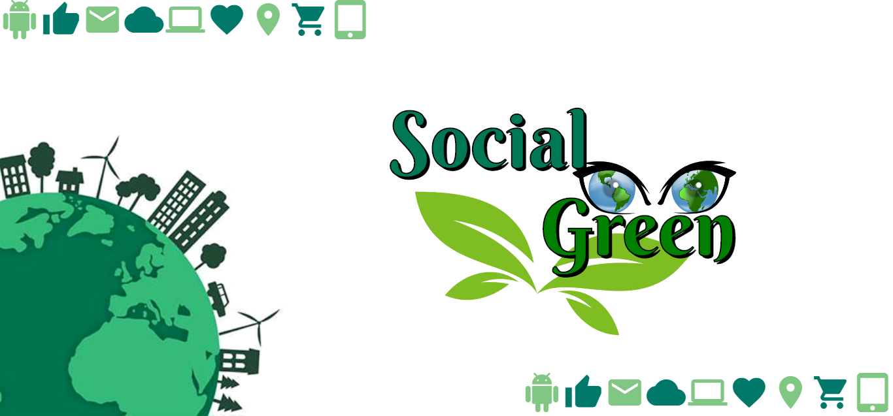
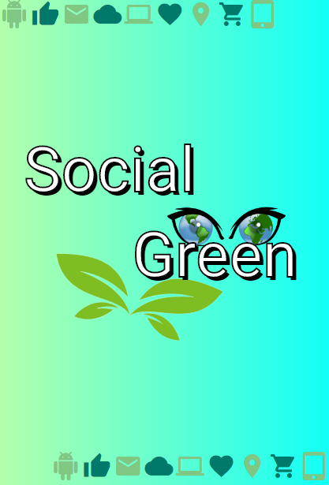
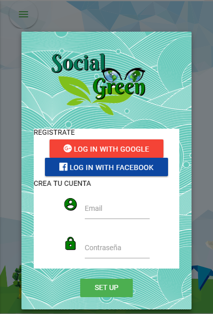
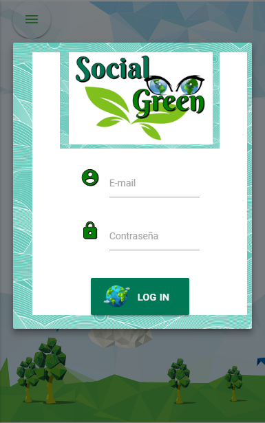

# **Social Green**
***Temática:*** Red Social para el cuidado del medio ambiente.

Nuestra red social invita a personas especialmente jovenes a ser parte de un red de gente interesada en mejorar nuestro medio ambiente con buenas practicas ambientales.. y postearlas vinculandolas con otras redes sociales
a travez de eventos o distintas interacciones entre los usuarios, como celebracion de dias especiales relacionados al tema

Esta red social promete ser muy llamativas para jovenes ya que las redes social estan en su dia a dia
generando una inclusion de cada vez mas gente a ser parte de la mejora ambiental y concientizacion .

#### Splash

#### Pagina principal

#### Modal de Registro

#### Modal de Registro con Google

#### Modal inicia Sesion con Google

#### Página de noticias

#### Perfil del usuario

